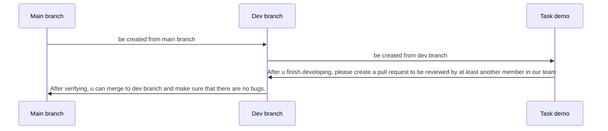

### 1. Project Folder Structure

- Reference: https://unity.com/how-to/organizing-your-project#folder-structure

Assets Folder

```
+----Animations <- to store animations
+----Audio <- to store all audio files
| +---Music
| +---Sound 
+----Scripts <- file entire code
+----Scenes <- to store scenes
+----Fonts <- to contain the fonts used in the game
+----Prefabs <- to reusable GameObjects and add them to a scene to build
```


### 2. Workflow on Github


